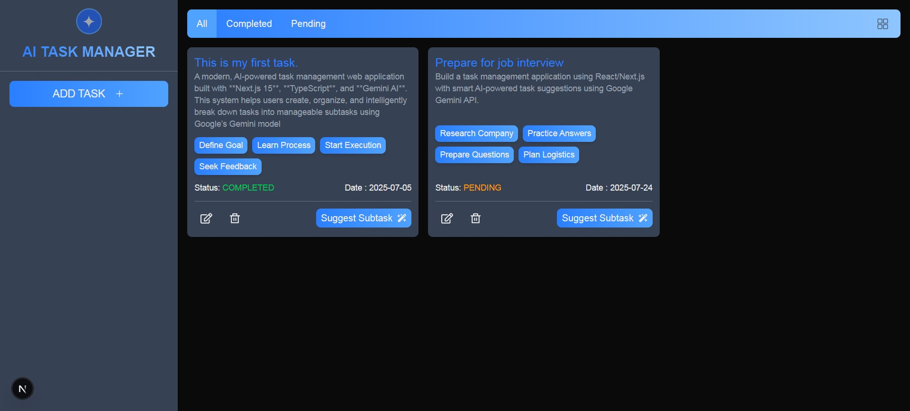

# 🧠 Smart Task Manager with AI (Gemini Integration)

A modern, AI-powered task management web application built with **Next.js 15**, **TypeScript**, and **Gemini AI**. This system helps users create, organize, and intelligently break down tasks into manageable subtasks using Google’s Gemini model.

 

---

## 🚀 Features

- ✅ Add, Edit, and Delete Tasks
- ✅ Track status: `Pending` / `Completed`
- ✅ Set due dates and task descriptions
- ✅ **AI-powered Subtask Generator** (via Gemini API)
- ✅ Toast notifications for actions
- ✅ Clean, responsive UI for desktop & mobile
- ✅ Built with modern React best practices (App Router)

---

## 🛠️ Tech Stack

| Technology       | Usage                                      |
|------------------|---------------------------------------------|
| **Next.js 15+**  | App Router, API Routes, SSR/CSR             |
| **React**        | UI framework                                |
| **TypeScript**   | Type safety                                 |
| **Tailwind CSS** | Modern utility-first styling                |
| **React Hook Form** | Efficient form handling                 |
| **Gemini API**   | AI-based subtask suggestions                |
| **React Toastify** | User-friendly notifications              |
| **React Icons**  | Icon library for elegant UI                |

---

## 📸 AI Feature Example

> Input: `Plan birthday party`  
> Gemini Suggests:
- Book venue
- Send invitations
- Order cake
- Plan decorations
- Prepare playlist

---

## 📦 Getting Started (Local Development)

Follow these instructions to set up and run the project locally.

### ✅ 1. Clone the Repository

```bash
git clone https://github.com/Sukanto01899/Smart-Task-Manager-with-AI-.git
cd Smart-Task-Manager-with-AI-
npm install
npm run dev
```

### My semester final exam is ahead, it was very difficult to do it in this situation, but still I tried to fulfill the requirements. I needed this opportunity. Because it will increase my skills and experience.